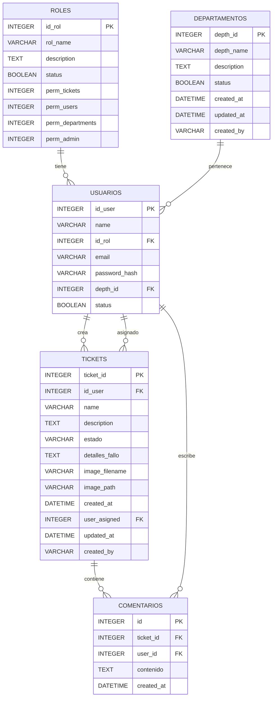

# Sistema_Ticket
Sistema de solicitud de tareas a diversas areas para tener un control del flujo de avance de las solicitudes de tareas especificas 

```mermaid
erDiagram

    ROLES {
        INTEGER id_rol PK
        VARCHAR rol_name
        TEXT description
        BOOLEAN status
        INTEGER perm_tickets
        INTEGER perm_users
        INTEGER perm_departments
        INTEGER perm_admin
    }

    DEPARTAMENTOS {
        INTEGER depth_id PK
        VARCHAR depth_name
        TEXT description
        BOOLEAN status
        DATETIME created_at
        DATETIME updated_at
        VARCHAR created_by
    }

    USUARIOS {
        INTEGER id_user PK
        VARCHAR name
        INTEGER id_rol FK
        VARCHAR email
        VARCHAR password_hash
        INTEGER depth_id FK
        BOOLEAN status
    }

    TICKETS {
        INTEGER ticket_id PK
        INTEGER id_user FK
        VARCHAR name
        TEXT description
        VARCHAR estado
        TEXT detalles_fallo
        VARCHAR image_filename
        VARCHAR image_path
        DATETIME created_at
        INTEGER user_asigned FK
        DATETIME updated_at
        VARCHAR created_by
    }

    COMENTARIOS {
        INTEGER id PK
        INTEGER ticket_id FK
        INTEGER user_id FK
        TEXT contenido
        DATETIME created_at
    }

    %% Relaciones
    ROLES ||--o{ USUARIOS : "tiene"
    DEPARTAMENTOS ||--o{ USUARIOS : "pertenece"
    USUARIOS ||--o{ TICKETS : "crea"
    USUARIOS ||--o{ TICKETS : "asignado"
    TICKETS ||--o{ COMENTARIOS : "contiene"
    USUARIOS ||--o{ COMENTARIOS : "escribe"
```
## Flujo de funcionamiento del sistema

